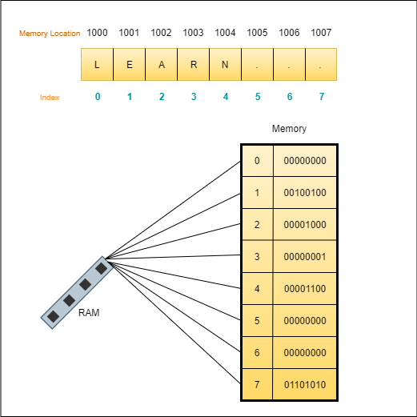

# Arrays
    An array is a collection of items stored at contiguous memory locations. 

- The contents of the array are allocated at adjacent memory locations. 
- We can calculate the position of each element by simply adding an offset to a base value. 
- Total number of elements in the array is called its **length**. 
- Inside array elements are stored in contiguous memory locations. 
- Arrays have smallest footprint of datastructures



# Two types of arrays.

1. Static Array
2. Dynamic Array.

## Static Array

Static array are normal arrays which have fixed length. We need to define the length of array before hand.

## Big O Notation of Array functions
- lookup        O(1)
- Push          O(1)
- Insert        O(n)
- Delete        O(n)

## Dynamic Array
Dynamic array allocate memory on the fly. Some languages support this inherently, for eg: Javascript, Python, etc... It works like this if the array is fully filled, the addition of last element will doubles the size of the array.

## Big O Notation of Array functions
- lookup        O(1)
- Push          O(1)
- Insert        O(n)
- Delete        O(n)

**\*\*The push operation can sometimes be O(n).** This happens because sometime when you are trying to push to an array and if it is full its likely going to iterate through each item of the array and copy it over to a new array having double its size so as to accomodate the new element.

# Advanced array topic

- Reference type
- Context
- Instantiation

## Reference Type

## Instantiation
Instantiation is making a copy of the object and reusing the code.


# Creating Array.

```py
# main.py

class Array(object):
    
    def __init__(self):
        self.index = -1
        self.data = dict()
    
    def __len__(self):
        return self.index + 1

    def __str__(self):
        return f"Array [{self.data}]"

    def __getitem__(self, index):
        return self.data[index]

    def add(self, item):
        self.index += 1
        self.data[self.index] = item

    def pop(self):
        pop_item = self.data[self.index]
        del self.data[self.index]
        self.index -= 1
        return pop_item

    def delete(self, index):
        for new_index in range(index, self.index):
            self.data[new_index] = self.data[new_index + 1]
        del self.data[self.index]
        self.index -= 1
    
    def insert(self, index, item):
        for new_index in range(self.index + 1, index, -1):
            self.data[new_index] = self.data[new_index - 1]
        self.data[index] = item
        self.index += 1
        
        
myarr = Array()
print("My array:: ", myarr)
print("Array Length:: ", len(myarr))

myarr.add("Akhil")
myarr.add("Arun")
myarr.add("Ajith")
myarr.add("Amal")
myarr.add(True)
print("My array after addition:: ", myarr)
print("Array Length::", len(myarr))

myarr.insert(4, "Ajith New")
print("My array after addition:: ", myarr)
print("Array Length::", len(myarr))

myarr.delete(4)
print("Deleting array at index 4...")
print("My array after deletion:: ", myarr)
print("new Array Length:: ", len(myarr))

# OUTPUTS
# My array::  Array [{}]
# Array Length::  0
# My array after addition::  Array [{0: 'Akhil', 1: 'Arun', 2: 'Ajith', 3: 'Amal', 4: True}]
# Array Length:: 5
# My array after addition::  Array [{0: 'Akhil', 1: 'Arun', 2: 'Ajith', 3: 'Amal', 4: 'Ajith New', 5: True}]
# Array Length:: 6
# Deleting array at index 4...
# My array after deletion::  Array [{0: 'Akhil', 1: 'Arun', 2: 'Ajith', 3: 'Amal', 4: True}]
# new Array Length::  5
```

```py
# test_array.py

import unittest
from main import Array

class TestArray(unittest.TestCase):
    
    def setUp(self):
        self.myarray = Array()
    
    def populate_fake_data(self):
        self.myarray.add("First Item")
        self.myarray.add("Second Item")
    
    def test_array_length(self):
        self.assertEqual(len(self.myarray), 0)
    
    def test_array_push(self):
        self.populate_fake_data()
        self.assertEqual(self.myarray[0], "First Item")
    
    def test_array_pop(self):
        self.populate_fake_data()
        self.assertEqual(self.myarray.pop(), "Second Item")
        with self.assertRaises(KeyError):
            self.myarray[1]
    
    def test_array_delete(self):
        self.populate_fake_data()
        with self.assertRaises(KeyError):
            self.myarray.delete(1)
            self.myarray[1]
    
    def test_array_insert(self):
        self.populate_fake_data()
        self.myarray.insert(1, "New Item")
        self.assertEqual(self.myarray[1], "New Item")
        self.assertEqual(self.myarray[0], "First Item")
        self.assertEqual(self.myarray[2], "Second Item")

if __name__ == '__main__':
    unittest.main()
```


## Problem on Arrays

Merge Sorted Arrays
```py
def mergeSortedArrays(arr1, arr2):
    mergeSortedArray = list()
    len_arr1 = len(arr1)
    len_arr2 = len(arr2)
    
    idx_arr1 = 0
    idx_arr2 = 0
    
    max_len = max(len_arr1, len_arr2)
    
    while(idx_arr1 < max_len or idx_arr2 < max_len):
        try:
            arr1[idx_arr1]
        except IndexError:
            mergeSortedArray.extend(arr2[idx_arr2:])
            break
        try:
            arr2[idx_arr2]
        except IndexError:
            mergeSortedArray.extend(arr1[idx_arr1:])
            break
            
        if arr1[idx_arr1] < arr2[idx_arr2] :
            mergeSortedArray.append(arr1[idx_arr1])
            idx_arr1 += 1
        else:
            mergeSortedArray.append(arr2[idx_arr2])
            idx_arr2 += 1

    return mergeSortedArray


    
print(mergeSortedArrays([4, 6, 30], [0, 3, 4, 31]))
```